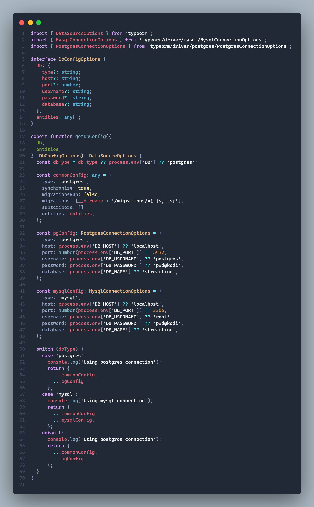

# StreamLine


  
<br>
<br>

This comprehensive solution is designed to streamline and optimize your business processes, providing a centralized platform to manage and coordinate various aspects of your enterprise. Whether you are a small business or a large corporation, our ERP software is tailored to meet your organizational needs and enhance overall efficiency.


### Modules under development
1. Asset Server
2. User Authentication and Authorization
3. Procurement
4. Accounts Branch
6. Customer Relations Management
7. Transport

<br>

## Setup the development server

**Install Dependencies and Setup Project**
```
# step 1: clone repo
git clone https://github.com/Web-Woods/streamline-procurement.git

# step 2: go to project directory and run
yarn install

# step 3: go to backend directory and run
yarn install

# step 4: go to fronend directory and run
yarn install
```

**Database Configurations**
Add database configurations in the `backend\libs\core\src\config\orm.config.ts` file.


**Run the Application**
Run the application using the following commands.
```
# go to backend folder and run
yarn start:dev streamline

# go to frontend folder and run
yarn dev:new
```

## Test the applications in dev mode
Frontend app starts on `http://localhost:3000`  
Backend app starts on `http://localhost:3333/graphql`  
Use a graphql client like **Altair** or use hte playgorund on `http://localhost:3333/graphql/playground`


